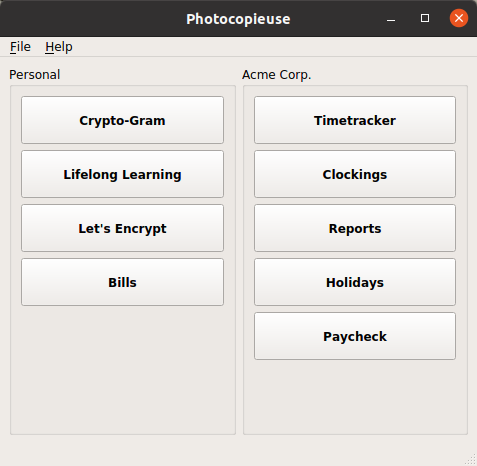
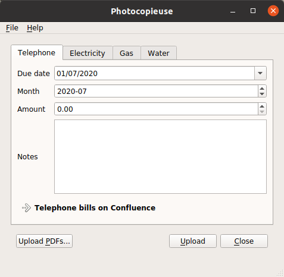

# Photocopieuse
> A collection of seemingly unrelated Paolo Bernardi's personal tools.

## Table of content

- [What is Photocopieuse](#what-is-photocopieuse)
- [What does it look like](#what-does-it-look-like)
- [License](#license)

## What is Photocopieuse

Photocopieuse is the integration of several tools to automate some tasks that involve creating Jira issues, updating Confluence pages, adding CalDAV calendar entries and so on.

I used to have a plethora of scattered programs to do this, each with its own specific characteristics: programmed in Python, Java, or BASH; graphical (Tk, Swing, Qt...) or textual.

Photocopieuse integrates of all these gimmicks in a single Python Qt application (the stub was created with fbs, even thought I don't really package it).

Needless to say, this software is next to useless for anyone without my specific needs (and without my specific configuration file, which I won't publish here for obvious reasons); still, it can be a nice reference about how to integrate Jira, Confluence and CalDAV with a Python program. Moreover, Photocopieuse has been a neat French learning hack, [but that's another story](https://www.bernardi.cloud/2020/04/26/da-zero-a-zero-in-3-non-tanto-semplici-passi/)...

## What does it look like

Nothing fancy:

# License

Photocopieuse is licensed under the terms of the GNU Affero General Public License version 3.